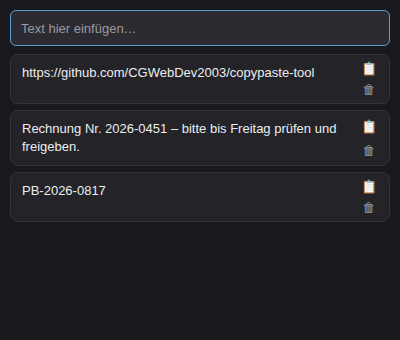

# PinBoard



PinBoard ist ein schlankes, immer sichtbares Fenster (Always-on-Top) unten rechts am Bildschirm, das als kleine Zwischenablage-Historie dient. Text und Bilder werden per Tastenkombination erfasst, bleiben dauerhaft gespeichert und lassen sich mit einem Klick wieder in die Zwischenablage kopieren.

## Funktionen

- **Always-on-Top-Fenster**, das unten rechts am Bildschirm andockt und sich automatisch an den Inhalt anpasst
- **Text und Bilder** aus der Zwischenablage erfassen (`Strg`/`Cmd` + `V`)
- **Verlauf** aller erfassten Einträge, persistent gespeichert im lokalen Speicher
- **Ein Klick zum Kopieren** eines Eintrags zurück in die Zwischenablage
- **Einträge löschen**, die nicht mehr gebraucht werden
- Neue Einträge lassen sich auch direkt im Eingabefeld oben eintippen

## Bedienung

1. PinBoard starten – das Fenster erscheint unten rechts und bleibt über allen anderen Fenstern sichtbar.
2. Mit `Strg` + `V` (bzw. `Cmd` + `V` auf macOS) wird der aktuelle Zwischenablage-Inhalt (Text oder Bild) als neuer Eintrag hinzugefügt.
3. Alternativ Text direkt in das obere Eingabefeld tippen und mit `Enter` bestätigen.
4. Mit dem 📋-Button neben einem Eintrag wird dieser zurück in die Zwischenablage kopiert.
5. Mit dem 🗑-Button wird ein Eintrag dauerhaft gelöscht.

## Installation & Start

```bash
npm install
npm start
```

## Build (Windows)

```bash
npm run dist
```

Erstellt ein installierbares Windows-Paket via `electron-builder`.

## Tech-Stack

- [Electron](https://www.electronjs.org/) für das native Desktop-Fenster
- Reines HTML/CSS/JavaScript für die Oberfläche, keine zusätzlichen Frontend-Frameworks
- Persistenz über `localStorage`
